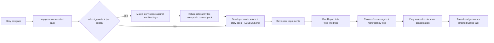

# EPIC-002: vdoc Integration — Context-Aware Bouncing

## 1. Problem & Value

### 1.1 The Problem

V-Bounce agents operate with limited system context. The Developer reads the Story spec and LESSONS.md, but has no awareness of existing feature documentation generated by vdoc. This means:
- Developers break documented behavior without knowing it exists
- QA validates against Story acceptance criteria but misses end-to-end flow regressions
- Context packs don't include relevant system knowledge that already exists in `vdocs/`
- Scribe gets spawned post-sprint with no guidance on *which* docs are stale — it audits everything
- The manifest (`_manifest.json`) exists as a semantic routing table but no V-Bounce script reads it

### 1.2 The Solution

Wire vdoc outputs (`vdocs/*.md` + `_manifest.json`) into the V-Bounce bounce loop so that agents automatically receive relevant system documentation as part of their context. Use the manifest's tags and descriptions for semantic matching against story scope, and use Dev Report `files_modified` to detect doc staleness automatically.

### 1.3 Success Metrics (North Star)
- Developer context packs include relevant vdocs when available — measured by manifest match hit rate
- QA bounce rate decreases for stories touching documented features (fewer "didn't know X depended on Y" failures)
- Scribe receives a targeted staleness report instead of auditing the full doc set
- Zero manual effort required — integration is automatic when `vdocs/_manifest.json` exists

---

## 2. Scope Boundaries

### ✅ IN-SCOPE (Build This)
- [ ] **vdoc YAML frontmatter** — Add YAML frontmatter to vdoc doc template and manifest schema so metadata (title, tags, version, keyFiles, lastUpdated) travels with each doc, not only in `_manifest.json`
- [ ] Context pack enrichment — `vbounce prep` commands read `_manifest.json` and include relevant vdoc excerpts
- [ ] Developer agent instructions — add "read relevant vdocs" to pre-coding checklist
- [ ] QA agent instructions — add vdoc cross-referencing for behavioral regression checks
- [ ] Automatic staleness detection — cross-reference `files_modified` from Dev Reports against manifest key files
- [ ] Pre-bounce doc impact warning — `validate_bounce_readiness.mjs` flags stories touching documented features
- [ ] Scribe task generation — Team Lead generates targeted Scribe tasks from staleness data instead of "audit everything"
- [ ] Sprint Report tracking — add "Docs Impacted" column or section to capture vdoc changes per sprint
- [ ] **Context slices** — AI-optimized doc excerpts (Overview + Business Rules + Key Files + Constraints) for token-efficient agent consumption
- [ ] **Doc quality scoring** — Mechanical audit checks (structural completeness, key file existence, diagram presence, cross-ref validity) with per-doc score
- [ ] **Manifest dependency graph** — `deps` array per manifest entry listing features that break if this feature changes; enables blast radius analysis

### ❌ OUT-OF-SCOPE (Do NOT Build This)
- Modifying vdoc core logic beyond what STORY-002-00/00a/00b cover — deep vdoc refactors belong in vdoc's own backlog
- Building a semantic search engine over vdocs — we use the manifest's tag matching, not embeddings
- Requiring vdoc as a dependency — all integrations are optional (graceful no-op when `vdocs/` doesn't exist)
- Architect agent integration — Architect audits structure, not feature behavior; vdoc context adds noise

---

## 3. Context

### 3.1 User Personas
- **AI Developer Agent**: Implements features — needs system context to avoid breaking existing behavior
- **AI QA Agent**: Validates changes — needs end-to-end flow knowledge beyond the Story spec
- **AI Team Lead**: Orchestrates — needs to know which docs are stale and generate targeted Scribe tasks
- **Human Developer**: Reviews sprint output — wants to see doc impact alongside code changes

### 3.2 User Journey (Happy Path)


### 3.3 Constraints
| Type | Constraint |
|------|------------|
| **Optional dependency** | All vdoc integrations MUST gracefully skip when `vdocs/_manifest.json` doesn't exist |
| **Token budget** | Context pack enrichment must respect `vbounce.config.json` context budget limits |
| **No vdoc modifications** | V-Bounce reads vdoc outputs but never modifies `vdocs/` or `_manifest.json` directly |
| **Backward compatible** | Existing projects without vdoc must work identically to today |

---

## 4. Technical Context

### 4.1 Affected Areas
| Area | Files/Modules | Change Type |
|------|---------------|-------------|
| Context pack scripts | `scripts/prep_qa_context.mjs`, `scripts/prep_arch_context.mjs`, `scripts/prep_sprint_context.mjs` | Modify — add manifest reading + tag matching |
| Bounce readiness | `scripts/validate_bounce_readiness.mjs` | Modify — add doc impact warning |
| Agent brains | `brains/claude-agents/developer.md`, `brains/claude-agents/qa.md` | Modify — add vdoc reading instructions |
| Agent-team skill | `skills/agent-team/SKILL.md` | Modify — add Scribe task generation from staleness data |
| Sprint report template | `templates/sprint_report.md` | Modify — add docs impacted tracking |
| New utility | `scripts/vdoc_match.mjs` (new) | New — manifest reader + tag matcher utility |

### 4.2 Dependencies
| Type | Dependency | Status |
|------|------------|--------|
| **Requires** | vdoc installed in target project (`vdocs/_manifest.json` exists) | External — user's choice |
| **Requires** | V-Bounce OS core (EPIC-001 / current release) | Done |
| **Unlocks** | Smarter Scribe agent (targeted audit vs full audit) | Waiting |

### 4.3 Integration Points
| System | Purpose | Docs |
|--------|---------|------|
| `vdocs/_manifest.json` | Semantic routing table — maps features to docs via tags and descriptions | vdoc README §Manifest |
| `vdocs/*.md` | Feature-centric docs with Key Files sections listing source file paths | vdoc README §Documentation Template |
| `vbounce.config.json` | Context budget settings — enrichment must respect token limits | V-Bounce OS config |

### 4.4 Data Changes
| Entity | Change | Fields |
|--------|--------|--------|
| Context pack output | MODIFY | + `vdoc_context` section with matched doc excerpts |
| Dev Report YAML | No change | Already has `files_modified` — we read it, don't modify |
| Sprint Report | MODIFY | + §1 "Product Docs Affected" auto-populated from staleness detection |
| Scribe task file | NEW | `.bounce/scribe-task-S-{XX}.md` — targeted list of stale docs + quality fix tasks |
| Context slices | NEW | `vdocs/_slices/{feature}.md` — token-optimized doc excerpts for agent context |
| Manifest schema | MODIFY | + `deps` array per entry (feature name strings) |

---

## 5. Decomposition Guidance

- [x] **vdoc Frontmatter** — Add YAML frontmatter to doc template + update generation/audit workflows
- [x] **Discovery Protocol** — Universal 4-layer behavior discovery (Capability Surface → Data Flows → Shared Behaviors → Integration Boundary)
- [x] **Utility Script** — Manifest reader + tag matcher (`vdoc_match.mjs`)
- [x] **Context Pack Enrichment** — Wire manifest matching into prep scripts
- [x] **Agent Instructions** — Update Developer + QA brain files
- [x] **Staleness Detection** — Cross-reference Dev Report files_modified against manifest
- [x] **Pre-Bounce Warning** — Add doc impact check to bounce readiness validator
- [x] **Scribe Task Generation** — Team Lead auto-generates targeted Scribe tasks
- [x] **Sprint Report Tracking** — Add docs impacted section
- [x] **vdoc Process Improvements** — Planning artifacts location, create workflow dedup, relatedDocs field, version tracking
- [x] **Context Slices** — AI-optimized doc excerpts for token-efficient agent context packs
- [x] **Doc Quality Scoring** — Mechanical quality checks in audit workflow with per-doc score
- [x] **Manifest Dependency Graph** — `deps` array per manifest entry for blast radius analysis

### Suggested Story Sequence
0. **STORY-002-00: vdoc YAML Frontmatter** *(vdoc repo)* — ✅ **DONE** — Added YAML frontmatter (`title`, `description`, `tags`, `version`, `keyFiles`, `relatedDocs`, `lastUpdated`) to doc template. Updated init/audit/create workflows to generate and maintain frontmatter. Updated manifest schema. Synced to all 10 platforms.
0a. **STORY-002-00a: Universal Discovery Protocol** *(vdoc repo)* — ✅ **DONE** — Added 4-layer behavior discovery protocol (`discovery-protocol.md`) to all 10 platform skills. Layers: Capability Surface, Data Flows, Shared Behaviors, Integration Boundary. Wired into init-workflow.md as Phase 2b. Updated `vdoc.mjs` installer with new file entries for all platforms.
0b. **STORY-002-00b: vdoc Process Improvements** *(vdoc repo)* — ✅ **DONE** — (1) Moved planning artifacts to `vdocs/_planning/`. (2) Writing rules consolidated across init/create workflows. (3) Added `relatedDocs` to frontmatter and template. (4) Added `version` tracking with auto-increment on audit patch. Synced to all 10 platforms.
0c. **STORY-002-00c: Context Slices** *(vdoc repo)* — ✅ **DONE** — Added context slice generation to init workflow (Step 5) and create workflow (Step 4). Slices output to `vdocs/_slices/{FEATURE_NAME}_SLICE.md`. Audit workflow regenerates slices for patched docs. Synced to all 10 platforms.
0d. **STORY-002-00d: Doc Quality Scoring** *(vdoc repo)* — ✅ **DONE** — Added Step 6 (Quality Score) to audit workflow with 8 mechanical checks. Score = % passing. Thresholds: 80%+ Good, 60-79% Acceptable, <60% Low (triggers quality fix task). Report format updated to include per-doc scores. Synced to all 10 platforms.
0e. **STORY-002-00e: Manifest Dependency Graph** *(vdoc repo)* — ✅ **DONE** — Added `deps` array to manifest schema. Init and create workflows now populate deps from Related Features table. Audit workflow validates deps consistency. Synced to all 10 platforms.
1. **STORY-002-01: Manifest Reader Utility** — ✅ **DONE** — Built `scripts/vdoc_match.mjs` with combined scoring algorithm (file path ×10, tag ×5, description ×3, title ×2). Supports `--story`, `--files`, `--keywords` inputs. Outputs JSON, context-pack markdown, or human-readable. Reads `deps` for blast radius warnings. Registered as `vbounce docs match`.
2. **STORY-002-02: Context Pack Enrichment** — ✅ **DONE** — Wired `vdoc_match.mjs --context` into `prep_qa_context.mjs` (uses story + files_modified) and `prep_sprint_context.mjs` (manifest summary table with deps). Graceful skip when no manifest.
3. **STORY-002-03: Agent Brain Updates** — ✅ **DONE** — `developer.md` already had step 5 (check product documentation). Added step 4 to `qa.md` for vdoc cross-referencing + blast radius awareness during validation.
4. **STORY-002-04: Staleness Detection + Scribe Task Generation** — ✅ **DONE** — Built `scripts/vdoc_staleness.mjs`. Cross-references Dev Reports' `files_modified` against manifest key files. Generates `.bounce/scribe-task-S-{XX}.md` with priority ranking. Updated SKILL.md Step 7.8 with automated staleness detection flow. Registered as `vbounce docs check`.
5. **STORY-002-05: Pre-Bounce Doc Impact Warning** — ✅ **DONE** — Added step 5 to `validate_bounce_readiness.mjs`. Checks story file path references against manifest key files. Emits warnings with blast radius (never blocks bounce).
6. **STORY-002-06: Sprint Report Docs Tracking** — ✅ **DONE** — Updated sprint report template §1 "Product Docs Affected" with structured table (Doc, Stale Key Files, Touched By, Priority, Scribe Action). Auto-populated from staleness detection.

---

## 6. Risks & Edge Cases
| Risk | Likelihood | Mitigation |
|------|------------|------------|
| Manifest doesn't exist (vdoc not installed) | High (many projects) | All scripts check for `_manifest.json` first; graceful no-op |
| Manifest is stale (docs out of sync with code) | Medium | Staleness detection catches this; Scribe task fixes it |
| Tag matching returns too many docs (token budget exceeded) | Medium | Limit to top 3 matches by relevance; respect `vbounce.config.json` budget |
| Tag matching returns wrong docs (false positives) | Low | Use both tag matching AND file path overlap for higher precision |
| Story scope too vague for meaningful matching | Low | Fall back to "no vdoc context available" — same as today |
| Context slices drift from parent doc | Medium | Slices auto-regenerate on doc update; audit checks slice freshness |
| Quality scoring too strict (flags good docs) | Low | Threshold tunable per project; start at 60%, adjust based on feedback |
| Deps array creates circular references | Low | Deps are informational, not enforced — cycles are valid (A depends on B depends on A) |

---

## 7. Acceptance Criteria (Epic-Level)

```gherkin
Feature: vdoc Integration — Context-Aware Bouncing

  Scenario: Developer gets vdoc context in context pack
    Given a project with vdocs/_manifest.json
    And a Story touching files covered by AUTHENTICATION_DOC.md
    When the Team Lead runs vbounce prep for that story
    Then the context pack includes the auth doc overview and key files
    And the Developer reads it before coding

  Scenario: Staleness detected after sprint
    Given a Dev Report listing files_modified that overlap with vdoc key files
    When the Team Lead consolidates the sprint
    Then a scribe task file is generated listing the stale docs
    And the Scribe agent receives a targeted audit task

  Scenario: No vdoc installed — graceful skip
    Given a project without vdocs/_manifest.json
    When any vbounce prep or validate command runs
    Then vdoc integration is silently skipped
    And all outputs are identical to today

  Scenario: Token budget respected
    Given a context pack with 3 matched vdocs
    When the total vdoc content exceeds the context budget
    Then only the top-ranked matches are included
    And a note indicates additional matches were truncated

  Scenario: Context slices used instead of full docs
    Given a project with vdocs/_slices/ containing compact excerpts
    When the Team Lead runs vbounce prep for a story
    Then the context pack includes slices (not full docs) for matched features
    And total token usage is under 30% of what full docs would consume

  Scenario: Doc quality scored during audit
    Given a vdoc with missing Business Rules and broken Key File paths
    When vdoc audit runs
    Then the audit report shows a quality score below 60%
    And a Scribe "quality fix" task is generated for that doc

  Scenario: Blast radius detected via manifest deps
    Given authentication.md has deps ["user-profile", "billing"]
    And a Story modifies authentication key files
    When the Team Lead runs vbounce prep
    Then the context pack includes a blast radius warning listing user-profile and billing

  Scenario: Multi-sprint staleness escalation
    Given payments.md key files were modified in sprints S-03, S-04, S-05
    And payments.md was last updated in S-02
    Then the scribe task marks payments.md as high-priority (3 sprints stale)
```

---

## 8. Open Questions
| Question | Options | Impact | Owner | Status |
|----------|---------|--------|-------|--------|
| Should vdoc context go to Architect agent too? | A: Yes (full context), B: No (noise for structural audit) | Affects STORY-002-03 scope | sandrinio | Decided: No (out of scope) |
| How to rank multiple manifest matches? | A: Tag overlap count, B: File path overlap, C: Combined score | Affects STORY-002-01 algorithm | sandrinio | Decided: C (file path ×10, tag ×5, desc ×3, title ×2) |
| Should staleness detection run automatically or on-demand? | A: Auto at sprint consolidation, B: Manual via `vbounce docs check` | Affects STORY-002-04 trigger | sandrinio | Decided: Both — auto in Step 7, manual via `vbounce docs check` |

---

## 9. Artifact Links

**Stories (Status Tracking):**
- [x] STORY-002-00-vdoc_yaml_frontmatter → Done *(vdoc repo)*
- [x] STORY-002-00a-discovery_protocol → Done *(vdoc repo)*
- [x] STORY-002-00b-vdoc_process_improvements → Done *(vdoc repo)*
- [x] STORY-002-00c-context_slices → Done *(vdoc repo)*
- [x] STORY-002-00d-doc_quality_scoring → Done *(vdoc repo)*
- [x] STORY-002-00e-manifest_deps_graph → Done *(vdoc repo)*
- [x] STORY-002-01-manifest_reader → Done — `scripts/vdoc_match.mjs` (combined scoring: file ×10, tag ×5, desc ×3, title ×2)
- [x] STORY-002-02-context_pack_enrichment → Done — wired into `prep_qa_context.mjs` + `prep_sprint_context.mjs`
- [x] STORY-002-03-agent_brain_updates → Done — `qa.md` step 4 (vdoc cross-reference), `developer.md` already had step 5
- [x] STORY-002-04-staleness_detection → Done — `scripts/vdoc_staleness.mjs` + SKILL.md Step 7.8a updated
- [x] STORY-002-05-pre_bounce_doc_warning → Done — `validate_bounce_readiness.mjs` step 5 (warning, never blocks)
- [x] STORY-002-06-sprint_report_docs → Done — sprint report template §1 "Product Docs Affected" table

**References:**
- vdoc README: `vdoc/README.md`
- vdoc manifest schema: `vdoc/skills/claude/references/manifest-schema.json`
- Scribe Agent: `V-Bounce-OS/brains/claude-agents/scribe.md`
- Agent-team SKILL: `V-Bounce-OS/skills/agent-team/SKILL.md`
- Context pack scripts: `V-Bounce-OS/scripts/prep_*_context.mjs`

---

## Change Log

| Date | Change | By |
|------|--------|-----|
| 2026-03-13 | Epic created — Draft | Team Lead |
| 2026-03-13 | Added STORY-002-00a (discovery protocol — done), STORY-002-00b (process improvements). Updated scope boundaries. | Team Lead |
| 2026-03-13 | Added STORY-002-00c (context slices), 00d (doc quality scoring), 00e (manifest deps graph). Extended 002-04 with sprint staleness counter. New acceptance scenarios + risks. | Team Lead |
| 2026-03-13 | Implemented all vdoc-side stories (002-00 through 002-00e). Updated doc-template, manifest-schema, init/create/audit workflows. Synced to all 10 platforms. | Team Lead |
| 2026-03-13 | Implemented all V-Bounce-side stories (002-01 through 002-06). Created vdoc_match.mjs + vdoc_staleness.mjs. Wired into prep scripts, bounce readiness, agent brains, SKILL.md Step 7, sprint report template, CLI. All open questions resolved. Epic status → Implemented. | Team Lead |
