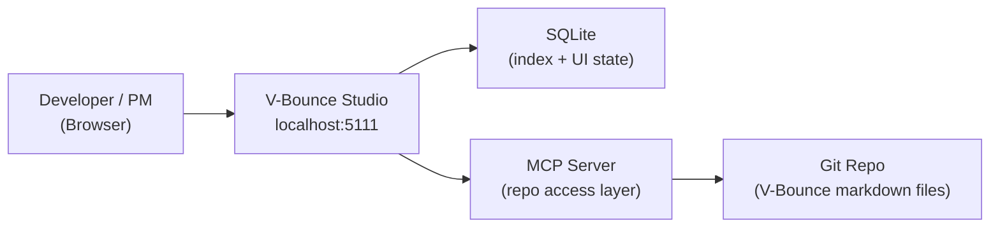

# Project Charter: V-Bounce Studio

> **Status**: 🌱 Initial Draft
> **Ambiguity Score**: 🟡 Medium — logic clear, some tech decisions TBD
> **Readiness**: Ready for Roadmap

---

## 1. Project Identity

### 1.1 What It Is
V-Bounce Studio is a localhost web application that serves as the visual control plane for the V-Bounce Framework. Developers and Product Managers run it locally (`localhost:5111`), connect it to any repo running V-Bounce, and get a real-time dashboard of their delivery plan, sprint state, story progress, agent reports, and bounce history — all rendered from the markdown files that already exist in the repo. Users can browse, edit, and manage V-Bounce documents through a UI instead of navigating raw markdown in their IDE.

### 1.2 What It Is NOT
- Not a cloud service — it runs entirely on the user's machine, no data leaves localhost
- Not an IDE or code editor — it manages the V-Bounce process layer, not source code
- Not a replacement for the V-Bounce Framework — the markdown files remain the source of truth; Studio is a lens on top of them
- Not a project management tool like Jira or Linear — it only understands V-Bounce document structures
- Not an AI agent orchestrator — it does not run or invoke AI agents directly (that remains the responsibility of the coding tool: Claude Code, Cursor, etc.)

### 1.3 Success Definition
- A user can run `npx vbounce-studio` in any V-Bounce repo and see their delivery dashboard within 10 seconds
- All V-Bounce markdown files (Charter, Roadmap, Epics, Stories, Delivery Plan, Sprint Reports, Hotfixes) are browsable and editable through the UI
- Changes made in Studio are written back to the markdown files — no proprietary format, no lock-in
- A PM with zero terminal experience can understand sprint status, story states, and bounce history without opening a single markdown file

---

## 2. Design Principles
> Numbered rules that guide ALL decisions. AI agents reference these when uncertain.

1. **Markdown Is Truth**: The repo's markdown files are always the source of truth. SQLite caches and indexes them but never replaces them. If Studio is uninstalled, nothing is lost.
2. **Zero Config Start**: `npx vbounce-studio` in a V-Bounce repo should work with no setup, no environment variables, no database migrations. First run creates everything it needs.
3. **Read-First, Edit-Second**: The primary value is visibility — showing what's in the repo clearly. Editing is secondary and must always write valid V-Bounce markdown back to disk.
4. **Stay Out of the Way**: Studio does not interfere with git, the IDE, or agent execution. It watches files and reflects state. It never locks files, never auto-commits, never modifies files unless the user explicitly saves an edit.
5. **Localhost Only**: No authentication, no accounts, no telemetry, no network calls. The app runs on `localhost:5111` and talks only to the local filesystem.

---

## 3. Architecture Overview

### 3.1 System Context

### 3.2 Technical Foundation
| Component | Choice | Status | Notes |
|-----------|--------|--------|-------|
| **Frontend** | Next.js (React) | Selected | App Router, server components for file reads |
| **Backend** | Next.js API Routes | Selected | No separate server needed |
| **Database** | SQLite (via better-sqlite3) | Selected | Single file, zero setup, embedded in Node process |
| **Repo Access** | MCP (Model Context Protocol) | Selected | Consistent with V-Bounce philosophy; filesystem operations through standardized protocol |
| **Markdown Parsing** | unified/remark ecosystem | TBD | Needs evaluation — must handle V-Bounce template structures (YAML frontmatter, tables, mermaid) |
| **File Watching** | chokidar or fs.watch | TBD | Detect external edits (from IDE or agents) and refresh UI |
| **Mermaid Rendering** | mermaid.js (client-side) | Selected | Render state machine and architecture diagrams inline |
| **Port** | 5111 | Selected | Avoids conflict with common dev ports (3000, 4000, 5000, 8080) |

---

## 4. Core Entities
> The nouns of your system. AI uses this to understand data flow.

| Entity | Purpose | Key Fields |
|--------|---------|------------|
| Project | A connected V-Bounce repo | id, path, name, last_synced |
| Charter | Project charter document | id, project_id, status, ambiguity_score, content_path |
| Roadmap | Release roadmap | id, project_id, releases[], content_path |
| Epic | Epic document | id, project_id, delivery, epic_number, name, content_path |
| Story | Story document | id, epic_id, story_number, vbounce_state, complexity_label, content_path |
| Hotfix | Hotfix document | id, project_id, delivery, name, status, content_path |
| DeliveryPlan | Sprint execution plan | id, project_id, delivery, active_sprint, content_path |
| SprintReport | Sprint report + retro | id, project_id, sprint_number, content_path |
| AgentReport | QA/Architect/Dev reports | id, story_id, agent_role, report_type, content_path |
| BounceEvent | Single bounce in the loop | id, story_id, from_agent, to_agent, bounce_count, timestamp |

---

## 5. Key Workflows
> The verbs of your system. Reference these in Epics.

### 5.1 Connect Repo
1. User runs `npx vbounce-studio` from a V-Bounce repo root (or passes a path)
2. Studio detects `product_plans/`, `skills/`, `templates/` directories to confirm it's a V-Bounce repo
3. Studio initializes SQLite database at `.vbounce-studio/studio.db` (gitignored)
4. Studio scans all markdown files, parses metadata, and indexes into SQLite
5. File watcher starts monitoring the repo for external changes
6. Browser opens `localhost:5111` with the project dashboard

### 5.2 View Dashboard
1. Dashboard shows: active sprint goal, story cards with V-Bounce states, bounce counts, and context pack status
2. Delivery Plan section shows sprint registry, backlog, escalated stories, parking lot
3. Sidebar navigation: Charter, Roadmap, Epics, Stories, Sprint Reports, Hotfixes, Lessons
4. State machine diagram renders live from current story states

### 5.3 Browse & Edit Document
1. User clicks any document (Story, Epic, Charter, etc.)
2. Studio renders the markdown with proper formatting (tables, mermaid diagrams, checklists)
3. User clicks "Edit" — document opens in a structured form view (fields mapped to template sections)
4. User modifies fields and clicks "Save"
5. Studio writes the updated markdown back to the file on disk (preserving V-Bounce template structure)
6. SQLite index updates automatically

### 5.4 Track Bounce History
1. Studio parses `.bounce/archive/` and `.bounce/reports/` for agent reports
2. Timeline view shows: which agent produced which report, when, for which story
3. Bounce count per story is calculated and displayed on story cards
4. If bounce count >= 3 on QA or Architect, story card shows "Escalated" badge

### 5.5 Sync on External Changes
1. File watcher detects a markdown file was modified (by IDE, agent, or git pull)
2. Studio re-parses the changed file and updates SQLite index
3. UI refreshes via server-sent events or polling
4. No data loss — Studio never overwrites external changes without user action

---

## 6. Constraints & Edge Cases
| Constraint | Mitigation |
|------------|------------|
| Large repos with many deliveries may have hundreds of markdown files | SQLite indexing + lazy loading — only parse files when accessed, index metadata on startup |
| Markdown parsing must handle V-Bounce-specific structures (YAML frontmatter, state enums, template sections) | Build a V-Bounce markdown schema that maps template sections to structured data |
| Multiple users on same repo (e.g., pair programming) | Studio is single-user by design (localhost). Git handles collaboration. No concurrent edit protection needed |
| Agent reports in `.bounce/reports/` are gitignored (ephemeral) | Studio reads them when present but doesn't fail when absent. Archive reports are the persistent record |
| Port 5111 may conflict with user's existing services | Allow `--port` flag override: `npx vbounce-studio --port 5222` |
| User edits a file in Studio while an agent is also writing to it | File watcher detects the conflict. Studio warns user and offers to reload from disk |

---

## 7. Open Questions

| Question | Options | Impact | Status |
|----------|---------|--------|--------|
| Should Studio support multiple repos simultaneously? | A: Single repo (simpler), B: Multi-repo with project switcher | Affects architecture — single vs multi-project SQLite | Open |
| How to handle Figma/design tool integration in requirements phase? | A: MCP connector for Figma, B: Manual screenshot/link embedding, C: Defer to future release | Blocks design-to-spec pipeline | Open |
| Should Studio be able to trigger agent runs (e.g., "Start Bounce")? | A: No — stay read/edit only, B: Yes — invoke Claude Code / Cursor commands | Scope creep risk vs killer feature | Open |
| Package distribution — npx only or also standalone binary? | A: npx (Node required), B: pkg/nexe for standalone, C: Docker image | Affects PM accessibility (non-devs may not have Node) | Open |
| Should Studio render a Kanban board view of story states? | A: Yes — visual board with drag-to-change-state, B: No — table/list view is sufficient | UX decision — Kanban is intuitive but adds complexity | Open |

---

## 8. Glossary
| Term | Definition |
|------|------------|
| V-Bounce Framework | The methodology and template system (skills, brain files, templates) that lives in the repo |
| V-Bounce Studio | This product — the localhost UI that visualizes and manages V-Bounce repos |
| Bounce | A single review-and-feedback cycle between agents (e.g., Dev → QA → back to Dev = 1 bounce) |
| Story State | The current position of a story in the V-Bounce state machine (Draft → ... → Done) |
| Context Pack | The set of prerequisites that must be complete before a story can enter the Bounce phase |
| Agent Report | A structured markdown document produced by an agent (QA Validation Report, Architect Audit Report, etc.) |
| Sprint | A time-boxed iteration (typically 1 week) during which stories are bounced and completed |
| Delivery | A release — maps 1:1 to a Roadmap release. Contains epics, stories, and a delivery plan |

---

## 9. References
- V-Bounce Framework repo: https://github.com/sandrinio/V-Bounce-Engine
- V-Bounce Framework npm: https://www.npmjs.com/package/@sandrinio/vbounce
- Cory Hymel's theory on structured AI development (inspiration)
- MCP Protocol specification: https://modelcontextprotocol.io
